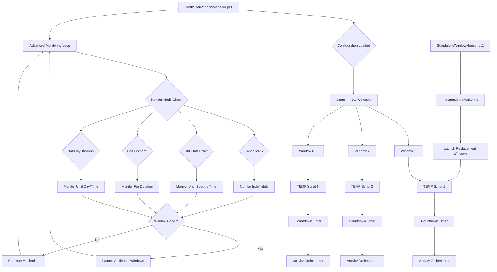
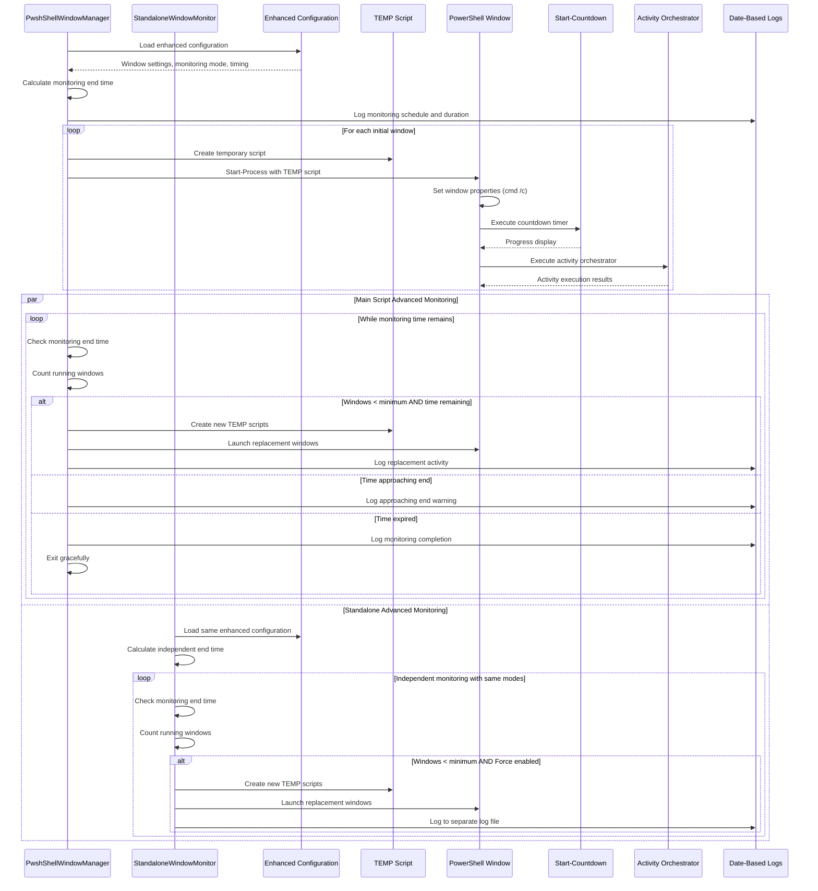

# PowerShell Window Manager & Activity Orchestrator - Enhanced Edition

A sophisticated PowerShell-based window management system that automatically launches and monitors multiple PowerShell windows with advanced monitoring modes, date-based logging, and independent monitoring capabilities.

## Overview

This enhanced system orchestrates multiple PowerShell windows running countdown timers and activity orchestration scripts. It features advanced monitoring modes, automatic date-based log rotation, independent monitoring capabilities, and comprehensive runtime controls for enterprise environments.

## 🆕 **Latest Enhancements**

### **Advanced Monitoring Modes**
- **Continuous**: Monitor indefinitely until manually stopped
- **UntilDateTime**: Monitor until a specific date and time
- **ForDuration**: Monitor for a specified number of minutes
- **UntilDayOfWeek**: Monitor until a specific day and time

### **Date-Based Logging System**
- Automatic daily log rotation while running
- Hierarchical folder structure: `YYYY\MM\DD\ScriptName_yyyyMMdd.log`
- Seamless midnight transitions without interruption
- Separate log files for different components

### **Standalone Monitor**
- Independent monitoring script with all main script capabilities
- Can add monitoring to systems where main script runs without it
- Force monitoring even when disabled in configuration
- Custom configuration file support

## Architecture



## System Components

### 1. Enhanced Main Controller: `PwshShellWindowManager.ps1`

The primary orchestration script with advanced monitoring capabilities.

**Key Features:**
- **4 Monitoring Modes**: Continuous, UntilDateTime, ForDuration, UntilDayOfWeek
- **Smart Runtime Controls**: Automatic end-time calculation and monitoring management
- **Date-Based Logging**: Automatic daily log rotation with hierarchical organization
- **Enhanced Window Counting**: Accurate counting excluding monitoring processes
- **ConstrainedLanguage Compatibility**: Works in enterprise security environments
- **Configurable Window Properties**: Size, color, auto-close timing
- **Comprehensive Error Handling**: Robust operation with detailed diagnostics

### 2. Standalone Monitor: `StandaloneWindowMonitor.ps1` 🆕

Independent monitoring script with full feature parity.

**Key Features:**
- **All Monitoring Modes**: Same 4 monitoring modes as main script
- **Independent Operation**: Runs separately from main window manager
- **Force Override**: Can monitor even when disabled in configuration
- **Custom Configuration**: Can use different config files for different environments
- **Date-Based Logging**: Separate log files to avoid conflicts
- **Same Runtime Controls**: All the sophisticated monitoring logic

### 3. Countdown Timer: `Start-Countdown.ps1`

Visual countdown timer with progress indication.

**Features:**
- Progress bar display using `Write-Progress`
- Configurable duration and message
- Error handling and graceful fallback
- Integration with window lifecycle

### 4. Activity Orchestrator: `Start-ActivityOrchestrator_v0.1.ps1`

Executes configurable activity sequences with retry logic.

**Features:**
- JSON configuration-based execution
- Iteration management with wait time randomization
- Comprehensive error handling and retries
- Detailed logging and statistics

### 5. TEMP Script Architecture

**Why Temporary Scripts Are Essential:**
- **ConstrainedLanguage Mode Compatibility**: Works around enterprise PowerShell restrictions
- **Complex Path Handling**: Resolves issues with special characters (parentheses, spaces)
- **Command Line Limits**: Avoids PowerShell parsing complications
- **Security Compliance**: Operates within strict corporate environments
- **Reliability**: Ensures consistent execution across different security contexts

## Advanced Monitoring Modes

### 1. **Continuous Mode** (Default)
Monitors indefinitely until manually stopped.
```json
{
  "MonitorSettings": {
    "Mode": "Continuous"
  }
}
```

**Use Cases:**
- 24/7 production environments
- Development systems requiring constant activity
- Long-running automated processes

### 2. **UntilDateTime Mode**
Monitors until a specific date and time.
```json
{
  "MonitorSettings": {
    "Mode": "UntilDateTime",
    "UntilDateTime": "2025-06-10 17:30:00"
  }
}
```

**Use Cases:**
- Scheduled maintenance windows
- Project deadline monitoring
- Event-based automation

### 3. **ForDuration Mode**
Monitors for a specified number of minutes.
```json
{
  "MonitorSettings": {
    "Mode": "ForDuration",
    "ForDurationMinutes": 240
  }
}
```

**Use Cases:**
- Testing scenarios with fixed duration
- Batch processing windows
- Resource-conscious environments

### 4. **UntilDayOfWeek Mode**
Monitors until a specific day and time.
```json
{
  "MonitorSettings": {
    "Mode": "UntilDayOfWeek",
    "UntilDayOfWeek": "Friday",
    "UntilTime": "17:00:00"
  }
}
```

**Use Cases:**
- Business hours automation
- Weekly maintenance cycles
- Work schedule alignment

## Enhanced Logging System

### Date-Based Log Organization
```
Logs/
├── 2024/
│   ├── 12/
│   │   ├── 23/
│   │   │   ├── Orchestrator_20241223.log
│   │   │   └── StandaloneMonitor_20241223.log
│   │   ├── 24/
│   │   │   ├── Orchestrator_20241224.log
│   │   │   └── StandaloneMonitor_20241224.log
│   │   └── 25/
│   │       ├── Orchestrator_20241225.log
│   │       └── StandaloneMonitor_20241225.log
```

### Log Features
- **Automatic Daily Rotation**: New log file created each day
- **Runtime Switching**: Seamlessly changes files at midnight
- **No Interruption**: Continuous logging during date transitions
- **Hierarchical Organization**: Easy to find logs by date
- **Separate Components**: Different logs for main script vs standalone monitor

### Log Content
**Main Orchestrator Logs** (`Orchestrator_YYYYMMDD.log`):
- Window launch and management events
- Monitoring mode transitions and duration calculations
- Window count detection and replacement activities
- Configuration loading and path verification
- Error conditions and recovery actions

**Standalone Monitor Logs** (`StandaloneMonitor_YYYYMMDD.log`):
- Independent monitoring cycles
- Force-mode operations
- Custom configuration usage
- Window replacement decisions
- Monitoring completion events

## File Structure

```
PowerShell/
├── PwshShellWindowManager/
│   ├── PwshShellWindowManager.ps1      # Enhanced main orchestrator
│   ├── StandaloneWindowMonitor.ps1     # 🆕 Independent monitor
│   ├── PwshWindowManager.json          # Enhanced configuration
│   └── Logs/                           # 🆕 Date-based log structure
│       └── YYYY/
│           └── MM/
│               └── DD/
│                   ├── Orchestrator_YYYYMMDD.log
│                   └── StandaloneMonitor_YYYYMMDD.log
├── CountDownTimers/
│   └── Start-Countdown.ps1             # Countdown timer script
└── ActivityGenerator.v3/
    ├── Start-ActivityOrchestrator_v0.1.ps1
    ├── ActivityGeneratorConfig.json     # Activity configuration
    ├── SimpleStartup.ps1               # Simple startup script
    ├── SimpleActivity.ps1              # Simple activity script
    └── Logs/
        └── ActivityGenerator.log        # Activity logs

%TEMP%/
└── OrchestratorWindow_*.ps1            # Temporary execution scripts
```

## Configuration

### Enhanced Configuration File: `PwshWindowManager.json`
```json
{
  "WindowSettings": {
    "Count": 4,
    "NoExit": false,
    "MinSeconds": 12,
    "MaxSeconds": 499000,
    "Cols": 80,
    "Lines": 10,
    "BgColor": "0A",
    "AutoCloseSeconds": 30
  },
  "MonitorSettings": {
    "Enable": true,
    "CheckInterval": 60,
    "MinWindows": 3,
    "AddIfBelow": 2,
    "MaxTotal": 8,
    "Mode": "UntilDayOfWeek",
    "UntilDateTime": "",
    "ForDurationMinutes": 240,
    "UntilDayOfWeek": "Friday",
    "UntilTime": "17:00:00"
  }
}
```

### Configuration Options

#### **Window Settings**
- `Count`: Number of initial windows to launch
- `NoExit`: Keep windows open after completion
- `MinSeconds`/`MaxSeconds`: Countdown timer range
- `Cols`/`Lines`: Window dimensions
- `BgColor`: Console color scheme (e.g., "0A" = black background, green text)
- `AutoCloseSeconds`: 🆕 Time before auto-closing windows when NoExit is false

#### **Monitor Settings**
- `Enable`: Enable/disable automatic monitoring
- `CheckInterval`: Monitoring frequency in seconds
- `MinWindows`: Minimum windows to maintain
- `AddIfBelow`: Number of windows to add when below minimum
- `MaxTotal`: Maximum total windows allowed
- `Mode`: 🆕 Monitoring mode (Continuous, UntilDateTime, ForDuration, UntilDayOfWeek)
- `UntilDateTime`: 🆕 End date/time for UntilDateTime mode (format: "2025-06-05 18:00:00")
- `ForDurationMinutes`: 🆕 Duration in minutes for ForDuration mode
- `UntilDayOfWeek`: 🆕 Target day for UntilDayOfWeek mode (Monday, Tuesday, etc.)
- `UntilTime`: 🆕 Target time for UntilDayOfWeek mode (24-hour format: "17:00:00")

## Installation & Setup

### Prerequisites
- PowerShell 5.1 or later
- Execution policy allowing script execution
- Write permissions to temp directory and log directories
- Network access if activity scripts require external resources

### Installation Steps

1. **Create Directory Structure**
   ```powershell
   # Main directory structure
   New-Item -ItemType Directory -Path "C:\PowerShell\PwshShellWindowManager" -Force
   New-Item -ItemType Directory -Path "C:\PowerShell\CountDownTimers" -Force  
   New-Item -ItemType Directory -Path "C:\PowerShell\ActivityGenerator.v3" -Force
   ```

2. **Deploy Scripts**
   - Place `PwshShellWindowManager.ps1` in main directory
   - Place `StandaloneWindowMonitor.ps1` in main directory
   - Place countdown and activity scripts in respective directories

3. **Configure Paths**
   - Update `$basePath` variable in both main and standalone scripts
   - Verify all path references point to your directory structure

4. **Set Execution Policy** (if needed)
   ```powershell
   Set-ExecutionPolicy -ExecutionPolicy RemoteSigned -Scope CurrentUser
   ```

5. **Create Activity Scripts**
   - Ensure required activity scripts exist
   - Configure `ActivityGeneratorConfig.json` appropriately

## Usage Scenarios

### Scenario 1: Business Hours Monitoring
Monitor only during business hours, Monday through Friday.
```json
{
  "MonitorSettings": {
    "Mode": "UntilDayOfWeek",
    "UntilDayOfWeek": "Friday",
    "UntilTime": "17:00:00"
  }
}
```

```powershell
# Start on Monday morning
.\PwshShellWindowManager.ps1
# Will monitor until Friday at 5 PM, then exit
```

### Scenario 2: Scheduled Maintenance Window
Monitor for a specific 4-hour maintenance window.
```json
{
  "MonitorSettings": {
    "Mode": "ForDuration",
    "ForDurationMinutes": 240
  }
}
```

```powershell
# Start maintenance monitoring
.\PwshShellWindowManager.ps1
# Will monitor for exactly 4 hours, then exit
```

### Scenario 3: Project Deadline Monitoring
Monitor until a specific project deadline.
```json
{
  "MonitorSettings": {
    "Mode": "UntilDateTime",
    "UntilDateTime": "2025-06-15 23:59:59"
  }
}
```

```powershell
# Start project monitoring
.\PwshShellWindowManager.ps1
# Will monitor until June 15, 2025 at 11:59:59 PM
```

### Scenario 4: Development with Continuous Monitoring
Continuous monitoring during development phases.
```json
{
  "MonitorSettings": {
    "Mode": "Continuous"
  }
}
```

```powershell
# Start continuous monitoring
.\PwshShellWindowManager.ps1
# Will monitor indefinitely until manually stopped
```

### Scenario 5: Adding Monitoring to Existing Setup
Main script running without monitoring, add independent monitoring.
```powershell
# Terminal 1: Main script (monitoring disabled in config)
.\PwshShellWindowManager.ps1

# Terminal 2: Add independent monitoring
.\StandaloneWindowMonitor.ps1 -Force
```

### Scenario 6: Multiple Environment Monitoring
Different monitoring configurations for different environments.
```powershell
# Production monitoring (continuous)
.\StandaloneWindowMonitor.ps1 -ConfigPath ".\ProdConfig.json"

# Test monitoring (4 hours only)
.\StandaloneWindowMonitor.ps1 -ConfigPath ".\TestConfig.json" -Force

# Development monitoring (until Friday evening)
.\StandaloneWindowMonitor.ps1 -ConfigPath ".\DevConfig.json"
```

## Advanced Usage

### Main Script Commands
```powershell
# Basic execution with default configuration
.\PwshShellWindowManager.ps1

# The script will:
# 1. Load enhanced configuration with monitoring modes
# 2. Launch configured number of windows
# 3. Start advanced monitoring based on selected mode
# 4. Maintain minimum window count with smart duration management
# 5. Exit gracefully when monitoring period ends
```

### Standalone Monitor Commands
```powershell
# Basic standalone monitoring (uses main config)
.\StandaloneWindowMonitor.ps1

# Force monitoring even if disabled in config
.\StandaloneWindowMonitor.ps1 -Force

# Use custom configuration file
.\StandaloneWindowMonitor.ps1 -ConfigPath "C:\Custom\MyConfig.json"

# Combine custom config with force monitoring
.\StandaloneWindowMonitor.ps1 -ConfigPath ".\TestEnv.json" -Force
```

### Runtime Behavior

**Enhanced Monitoring Loop Features:**
- **End-Time Calculation**: Automatically calculates when monitoring should end
- **Approach Warning**: Warns when within 5 minutes of end time
- **Graceful Exit**: Completes current cycle before exiting
- **Duration Reporting**: Reports total monitoring duration upon completion
- **Mode Persistence**: Remembers and reports monitoring mode used

**Example Runtime Output:**
```
[INFO] Monitoring mode: UntilDayOfWeek - Will monitor until Friday at 17:00:00 (2024-12-27 17:00:00)
[INFO] Monitoring will run for approximately: 02.08:30:00
[INFO] Monitoring will end at: 2024-12-27 17:00:00
[WARN] Monitoring will end in 4.2 minutes
[INFO] Monitoring period has ended. Duration: 02.08:30:00
[INFO] Total monitoring duration: 02.08:30:00
[INFO] Monitoring mode was: UntilDayOfWeek
```

## Process Flow



## Monitoring Mode Examples

### Configuration Examples for Each Mode

#### **Continuous Monitoring**
```json
{
  "MonitorSettings": {
    "Enable": true,
    "Mode": "Continuous",
    "CheckInterval": 60,
    "MinWindows": 3,
    "AddIfBelow": 2,
    "MaxTotal": 8
  }
}
```

#### **Specific Date/Time Monitoring**
```json
{
  "MonitorSettings": {
    "Enable": true,
    "Mode": "UntilDateTime",
    "UntilDateTime": "2025-06-10 17:30:00",
    "CheckInterval": 60,
    "MinWindows": 3,
    "AddIfBelow": 2,
    "MaxTotal": 8
  }
}
```

#### **Duration-Based Monitoring**
```json
{
  "MonitorSettings": {
    "Enable": true,
    "Mode": "ForDuration",
    "ForDurationMinutes": 480,
    "CheckInterval": 60,
    "MinWindows": 3,
    "AddIfBelow": 2,
    "MaxTotal": 8
  }
}
```

#### **Weekly Schedule Monitoring**
```json
{
  "MonitorSettings": {
    "Enable": true,
    "Mode": "UntilDayOfWeek",
    "UntilDayOfWeek": "Friday",
    "UntilTime": "17:00:00",
    "CheckInterval": 60,
    "MinWindows": 3,
    "AddIfBelow": 2,
    "MaxTotal": 8
  }
}
```

## Troubleshooting

### Common Issues

1. **"Cannot invoke method" Errors**
   - **Cause**: ConstrainedLanguage mode restrictions
   - **Solution**: Both scripts use cmd-based operations and avoid restricted methods

2. **Monitoring Mode Errors**
   - **Cause**: Invalid date/time formats or day names
   - **Solution**: Verify format matches examples (dates: "yyyy-MM-dd HH:mm:ss", days: "Monday", times: "17:00:00")

3. **Standalone Monitor Won't Start**
   - **Cause**: Monitoring disabled in config and no -Force parameter
   - **Solution**: Use `-Force` parameter or enable monitoring in configuration

4. **Log File Permission Errors**
   - **Cause**: Insufficient permissions for creating date-based directory structure
   - **Solution**: Run as administrator or adjust directory permissions

5. **Window Count Inaccuracies**
   - **Cause**: Multiple monitoring processes interfering
   - **Solution**: Enhanced counting logic excludes monitoring windows automatically

6. **Path Not Found Errors**
   - **Cause**: Incorrect path configuration in both scripts
   - **Solution**: Verify all paths in both main and standalone scripts point to existing files

### Debug Techniques

#### **Enable Detailed Logging**
Check log files for DEBUG level messages:
```powershell
# View today's main script log
Get-Content ".\Logs\2024\12\25\Orchestrator_20241225.log" | Where-Object { $_ -like "*DEBUG*" }

# View standalone monitor log
Get-Content ".\Logs\2024\12\25\StandaloneMonitor_20241225.log" | Where-Object { $_ -like "*MONITOR*" }
```

#### **Monitor Configuration Loading**
```powershell
# Check configuration parsing
Get-Content ".\Logs\2024\12\25\Orchestrator_20241225.log" | Where-Object { $_ -like "*Configuration*" }
```

#### **Verify Monitoring Mode Operation**
```powershell
# Check monitoring mode logs
Get-Content ".\Logs\2024\12\25\Orchestrator_20241225.log" | Where-Object { $_ -like "*Monitoring mode*" }
```

## Security Considerations

- **Enterprise Compliance**: Scripts operate within PowerShell execution policy constraints
- **ConstrainedLanguage Mode**: Full compatibility with restricted PowerShell environments
- **No Credential Storage**: No persistent credential storage or transmission
- **Minimal Dependencies**: Reduced external dependencies for security scanning
- **Audit Trail**: Comprehensive date-based logging provides complete audit trail
- **TEMP File Management**: Automatic cleanup prevents accumulation of temporary files
- **Process Isolation**: Each window operates independently for security boundaries

## Performance Considerations

- **Monitoring Overhead**: Check interval affects system resource usage
- **Window Scaling**: Large numbers of windows may impact system performance
- **Log Management**: Date-based rotation prevents disk space issues
- **Memory Usage**: Enhanced window counting minimizes memory overhead
- **Network Impact**: Activity scripts may generate network traffic
- **CPU Utilization**: Background monitoring uses minimal CPU resources

## Version History

- **v1.0**: Initial release with basic window management
- **v1.1**: Added ConstrainedLanguage mode support
- **v1.2**: Implemented TEMP script architecture for reliability
- **v1.3**: Enhanced error handling and logging
- **v1.4**: 🆕 Added standalone monitor and date-based logging
- **v1.5**: 🆕 Added advanced monitoring modes (UntilDateTime, ForDuration, UntilDayOfWeek)
- **v1.6**: 🆕 Enhanced window counting and runtime controls
- **v1.7**: 🆕 Complete feature parity between main script and standalone monitor

## API Reference

### Command Line Parameters

#### **PwshShellWindowManager.ps1**
```powershell
.\PwshShellWindowManager.ps1
# No parameters - uses default configuration file
```

#### **StandaloneWindowMonitor.ps1**
```powershell
.\StandaloneWindowMonitor.ps1 [-ConfigPath <String>] [-Force]

# Parameters:
# -ConfigPath: Path to configuration file (default: ".\PwshWindowManager.json")
# -Force: Force monitoring even if Enable=false in configuration
```

### Configuration Schema

```json
{
  "WindowSettings": {
    "Count": "Integer - Number of initial windows",
    "NoExit": "Boolean - Keep windows open after completion",
    "MinSeconds": "Integer - Minimum countdown seconds",
    "MaxSeconds": "Integer - Maximum countdown seconds", 
    "Cols": "Integer - Window columns",
    "Lines": "Integer - Window lines",
    "BgColor": "String - Console color code",
    "AutoCloseSeconds": "Integer - Auto-close timeout"
  },
  "MonitorSettings": {
    "Enable": "Boolean - Enable monitoring",
    "CheckInterval": "Integer - Check frequency in seconds",
    "MinWindows": "Integer - Minimum windows to maintain",
    "AddIfBelow": "Integer - Windows to add when below minimum",
    "MaxTotal": "Integer - Maximum total windows",
    "Mode": "String - Monitoring mode: Continuous|UntilDateTime|ForDuration|UntilDayOfWeek",
    "UntilDateTime": "String - End date/time: 'yyyy-MM-dd HH:mm:ss'",
    "ForDurationMinutes": "Integer - Duration in minutes",
    "UntilDayOfWeek": "String - Day name: Monday|Tuesday|Wednesday|Thursday|Friday|Saturday|Sunday",
    "UntilTime": "String - Time in 24-hour format: 'HH:mm:ss'"
  }
}
```

## Contributing

When modifying the enhanced system:

1. **Test All Monitoring Modes**: Verify Continuous, UntilDateTime, ForDuration, and UntilDayOfWeek modes
2. **Verify ConstrainedLanguage Compatibility**: Test in both standard and restricted environments
3. **Test Date-Based Logging**: Ensure log rotation works correctly across date boundaries
4. **Validate Standalone Monitor**: Ensure feature parity with main script
5. **Check Configuration Handling**: Verify all new configuration options work correctly
6. **Test Path Handling**: Verify compatibility with special characters in paths
7. **Verify Cleanup**: Ensure TEMP file cleanup operates correctly
8. **Update Documentation**: Keep configuration examples and usage scenarios current

## Support

For technical support:
1. **Check Logs**: Review date-based logs for detailed error information
2. **Verify Configuration**: Ensure all monitoring mode settings are correct
3. **Test Components**: Run individual scripts to isolate issues
4. **Check Permissions**: Verify file and directory access permissions
5. **Review Mode Logic**: Ensure monitoring mode configuration is valid

---

**Note**: This enhanced system is designed for enterprise environments requiring sophisticated PowerShell window management with advanced monitoring modes, comprehensive logging, independent monitoring capabilities, and robust security compliance.