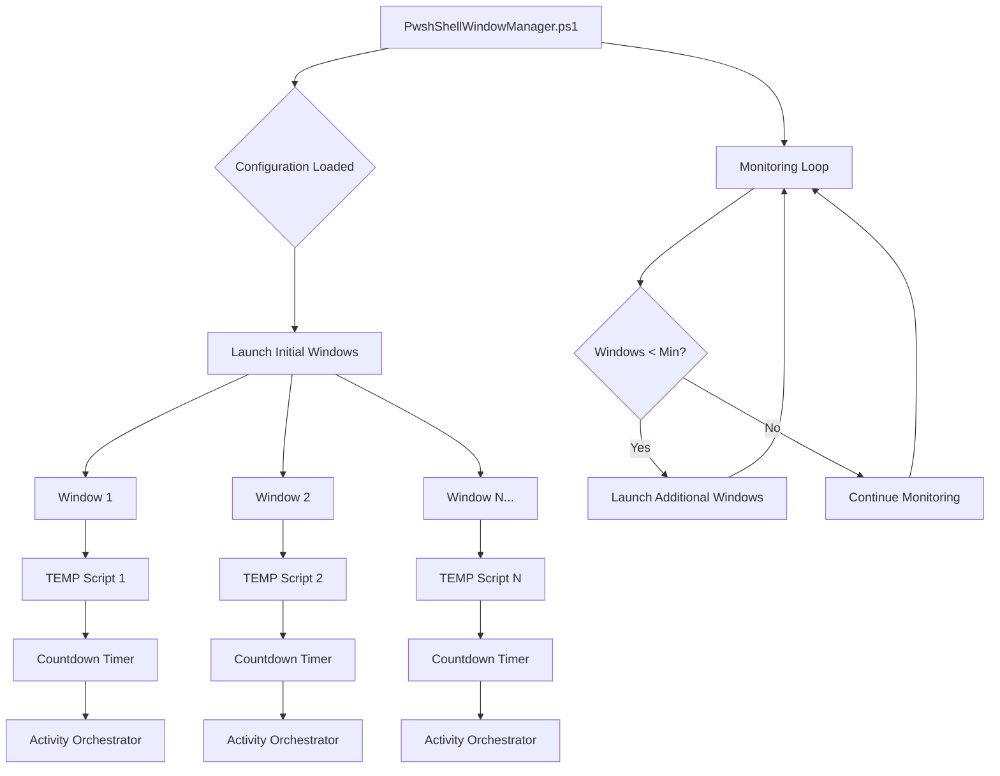
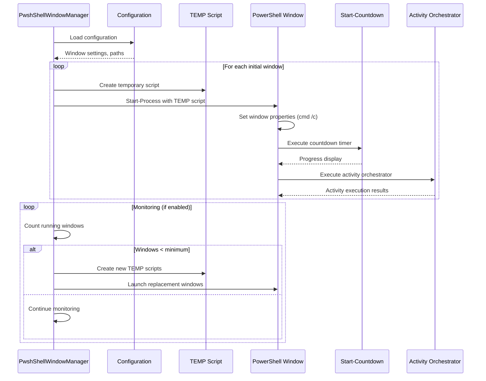

# PowerShell Window Manager & Activity Orchestrator

A robust PowerShell-based window management system that automatically launches and monitors multiple PowerShell windows running countdown timers and activity orchestration scripts.

## Overview

This system orchestrates multiple PowerShell windows, each running a countdown timer followed by an activity orchestrator. It includes automatic monitoring to maintain minimum window counts and comprehensive logging.

## Architecture



## System Components

### 1. Main Controller: `PwshShellWindowManager.ps1`

The primary orchestration script that manages window lifecycle and monitoring.

**Key Features:**
- Configurable window count and properties
- Automatic monitoring and window replacement
- Comprehensive logging with rotation
- JSON-based configuration management
- Support for ConstrainedLanguage mode environments

### 2. Countdown Timer: `Start-Countdown.ps1`

A visual countdown timer with progress indication.

**Features:**
- Progress bar display using `Write-Progress`
- Configurable duration and message
- Error handling and graceful fallback

### 3. Activity Orchestrator: `Start-ActivityOrchestrator_v0.1.ps1`

Executes configurable activity sequences with retry logic.

**Features:**
- JSON configuration-based execution
- Iteration management with wait time randomization
- Comprehensive error handling and retries
- Detailed logging and statistics

### 4. Temporary Window Scripts

**Why We Use TEMP Scripts:**
- **Security Compliance**: Works around PowerShell ConstrainedLanguage mode restrictions
- **Path Handling**: Resolves complex path escaping issues (parentheses in usernames)
- **Command Line Limits**: Avoids PowerShell command-line parsing complications
- **Reliability**: Ensures consistent execution across different security environments

## Process Flow



## File Structure

```
PowerShell/
├── PwshShellWindowManager/
│   ├── PwshShellWindowManager.ps1      # Main orchestrator
│   ├── PwshWindowManager.json          # Configuration file
│   └── Logs/
│       └── Orchestrator_YYYYMMDD.log   # Daily log files
├── CountDownTimers/
│   └── Start-Countdown.ps1             # Countdown timer script
└── ActivityGenerator.v3/
    ├── Start-ActivityOrchestrator_v0.1.ps1
    ├── ActivityGeneratorConfig.json     # Activity configuration
    └── Logs/
        └── ActivityGenerator.log        # Activity logs

%TEMP%/
└── OrchestratorWindow_*.ps1            # Temporary execution scripts
```

## Configuration Files

### PwshWindowManager.json
```json
{
  "WindowSettings": {
    "Count": 4,
    "NoExit": false,
    "MinSeconds": 12,
    "MaxSeconds": 499000,
    "Cols": 80,
    "Lines": 10,
    "BgColor": "0A"
  },
  "MonitorSettings": {
    "Enable": true,
    "CheckInterval": 60,
    "MinWindows": 1,
    "AddIfBelow": 2,
    "MaxTotal": 10
  }
}
```

### ActivityGeneratorConfig.json
```json
{
  "workingDirectory": "C:\\Path\\To\\ActivityGenerator.v3",
  "scripts": {
    "startup": ".\\StartupScript.ps1",
    "orchestrator": ".\\OrchestratorScript.ps1"
  },
  "logging": {
    "logPath": ".\\Logs\\ActivityGenerator.log",
    "logRetentionDays": 30
  },
  "iterations": {
    "default": 5,
    "waitTimes": [
      {"minWait": 1000, "maxWait": 5000},
      {"minWait": 2000, "maxWait": 8000}
    ]
  },
  "execution": {
    "maxRetries": 3,
    "retryDelaySeconds": 5
  }
}
```

## Installation & Setup

### Prerequisites
- PowerShell 5.1 or later
- Execution policy allowing script execution
- Write permissions to temp directory and log directories

### Installation Steps

1. **Download Scripts**
   ```powershell
   # Create directory structure
   New-Item -ItemType Directory -Path "C:\PowerShell\PwshShellWindowManager" -Force
   New-Item -ItemType Directory -Path "C:\PowerShell\CountDownTimers" -Force  
   New-Item -ItemType Directory -Path "C:\PowerShell\ActivityGenerator.v3" -Force
   ```

2. **Configure Paths**
   - Update the `$basePath` variable in `PwshShellWindowManager.ps1`
   - Modify configuration files to match your directory structure

3. **Set Execution Policy** (if needed)
   ```powershell
   Set-ExecutionPolicy -ExecutionPolicy RemoteSigned -Scope CurrentUser
   ```

4. **Create Required Scripts**
   - Ensure `StartupScript.ps1` and `OrchestratorScript.ps1` exist in ActivityGenerator.v3
   - Configure `ActivityGeneratorConfig.json` with appropriate settings

## Usage

### Basic Execution
```powershell
# Run with default configuration
.\PwshShellWindowManager.ps1

# The script will:
# 1. Load configuration from PwshWindowManager.json
# 2. Launch configured number of windows
# 3. Start monitoring loop (if enabled)
# 4. Maintain minimum window count automatically
```

### Configuration Options

**Window Settings:**
- `Count`: Number of initial windows to launch
- `Cols`/`Lines`: Window dimensions 
- `BgColor`: Console color scheme (e.g., "0A" = black background, green text)
- `MinSeconds`/`MaxSeconds`: Countdown timer range
- `NoExit`: Keep windows open after completion

**Monitoring:**
- `Enable`: Automatic window replacement
- `CheckInterval`: Monitoring frequency (seconds)
- `MinWindows`: Minimum windows to maintain
- `AddIfBelow`: Windows to add when below minimum

## TEMP Script Architecture

### Why Temporary Scripts Are Necessary

The system creates temporary `.ps1` files in `%TEMP%` because:

1. **ConstrainedLanguage Mode Compatibility**
   - Many corporate environments restrict PowerShell object manipulation
   - TEMP scripts use only basic cmdlets and external commands
   - Avoids `New-Object` and complex host UI operations

2. **Complex Path Handling**
   - Usernames with special characters (parentheses, spaces)
   - Eliminates escaping nightmares in command-line arguments
   - Ensures reliable path resolution

3. **Command Line Length Limits**
   - Avoids PowerShell's command-line parsing issues
   - Prevents argument truncation with long paths
   - Provides better error isolation

### TEMP Script Lifecycle


## Logging

### Main Orchestrator Logs
Location: `.\Logs\Orchestrator_YYYYMMDD.log`

**Log Levels:**
- `INFO`: Normal operations
- `WARN`: Non-critical issues
- `ERROR`: Failures requiring attention
- `DEBUG`: Detailed execution information

### Activity Orchestrator Logs
Location: `ActivityGenerator.v3\Logs\ActivityGenerator.log`

**Includes:**
- Iteration statistics
- Performance metrics
- Error details with retry counts
- Configuration validation results

## Troubleshooting

### Common Issues

1. **"Cannot invoke method" Errors**
   - **Cause**: ConstrainedLanguage mode restrictions
   - **Solution**: The current version uses cmd-based window management to avoid this

2. **Path Not Found Errors**
   - **Cause**: Incorrect path configuration
   - **Solution**: Verify all paths in configuration files exist and are accessible

3. **Window Sizing Failures**
   - **Cause**: Terminal limitations or security restrictions
   - **Solution**: Reduce window dimensions or disable sizing in config

4. **Permission Denied**
   - **Cause**: Insufficient permissions for temp directory or target directories
   - **Solution**: Run as administrator or adjust directory permissions

### Debug Mode
Enable detailed logging by setting log level to DEBUG in the script configuration.

## Security Considerations

- Scripts operate within PowerShell execution policy constraints
- TEMP files are automatically cleaned up
- No persistent credential storage
- Minimal external dependencies
- Compatible with enterprise security environments

## Performance Notes

- Monitoring interval affects system resource usage
- Large numbers of windows may impact system performance
- Log rotation prevents disk space issues
- Background cleanup jobs maintain temp directory hygiene

## Version History

- **v1.0**: Initial release with basic window management
- **v1.1**: Added ConstrainedLanguage mode support
- **v1.2**: Implemented TEMP script architecture for reliability
- **v1.3**: Enhanced error handling and logging

## Contributing

When modifying the system:
1. Test in both standard and ConstrainedLanguage PowerShell environments
2. Verify path handling with special characters
3. Ensure TEMP file cleanup operates correctly
4. Update configuration documentation for new options

---

**Note**: This system is designed for environments requiring automated PowerShell window management with robust error handling and security compliance.